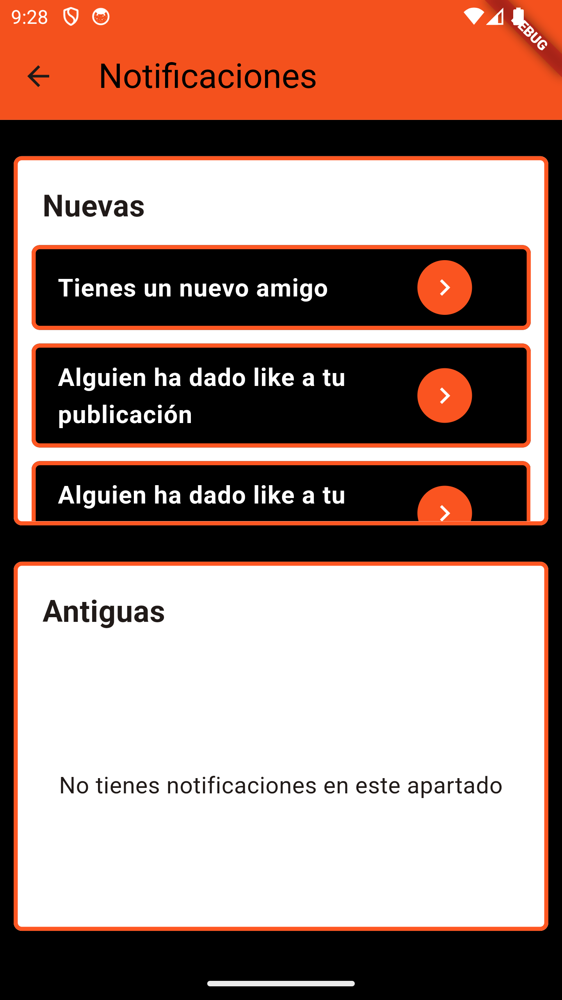

# Images Social Network App

Proyecto realizado para mi TFG, consistente en una aplicación móvil desarrollada en Dart a través del framework Flutter. La aplicación se trata de una red social basada en la publicación y la edición de imágenes.

## Organización del proyecto

- **android/**: Contiene configuraciones y archivos específicos para Android. No se han generado configuraciones para iOS o cualquier otro sistema operativo.
  
- **assets/**: Almacena recursos estáticos, concretamente imágenes que utiliza la aplicación.

- **capturasApp/**: Aquí se encuentran capturas de pantalla de casos de uso reales de la aplicación. Estas capturas se muestran en el último apartado de este README.md.
  
- **lib/**: Contiene el código fuente de la aplicación en **Dart**. Aquí se encuentra la lógica principal de la app y los componentes de la interfaz de usuario. La organización de las subcarpetas y los archivos contenidos en lib/ trata de hacer fácilmente identificables los distintos actores de la arquitectura MVC.
  
- **test/**: Aunque para este proyecto no se han incluido tests, esta carpeta está destinada a incluir archivos de pruebas unitarias y de widgets para verificar la funcionalidad de la aplicación.
  
- **Archivos destacables del directorio raíz**:
  - **memoria.pdf**: Documentación completa del trabajo realizado a lo largo de todo el desarrollo del TFG. Incluye la definición de todas las funcionalidades que aporta la app, el listado de tecnologías empleadas, la metodología de desarrollo aplicada, la arquitectura y los patrones de diseño software, y el manual de usuario. También se explica detalladamente la estructuración del proyecto en Android Studio, concretando el reparto de responsabilidades entre los distintos archivos y carpetas.
  - **pubspec.yaml**: Archivo de configuración del proyecto que gestiona dependencias y recursos.

## Ejecución en Android Studio

Tras descargar el repositorio, podremos ejecutarlo siguiendo los siguientes pasos:

1. Abrimos el proyecto en Android Studio como un proyecto Flutter.
2. Ejecutamos desde la terminal y en el directorio raíz del proyecto el comando `flutter pub get` para obtener las dependencias necesarias para la ejecución de la aplicación.
3. Finalmente, para ejecutar la aplicación en el simulador proporcionado por Android Studio, podemos seguir dos pasos:

   3.1. ***Opción A***: Ejecutar el comando `flutter run` desde la terminal y en el directorio raíz del proyecto.

   3.2. ***Opción B***: Desde el Device Manager de Android Studio encender el simulador que deseemos y, posteriormente, pulsar sobre el icono de "ejecutar" del IDE.

## Muestra de la interfaz de la aplicación

### Registro de usuario

    

### Explorar

    

### Buscar usuarios seguidos

    

### Listado de ejemplos

    

### Editor

    

### Aplicación de filtros a imagen

    

### Adición de textos a imagen

    

### Perfil de usuario propio

    

### Perfil de otro usuario

    

### Vista grande del listado de imágenes de un perfil

    

### Edición de una publicación

    

### Lista de amigos

    

### Notificaciones nuevas

    

